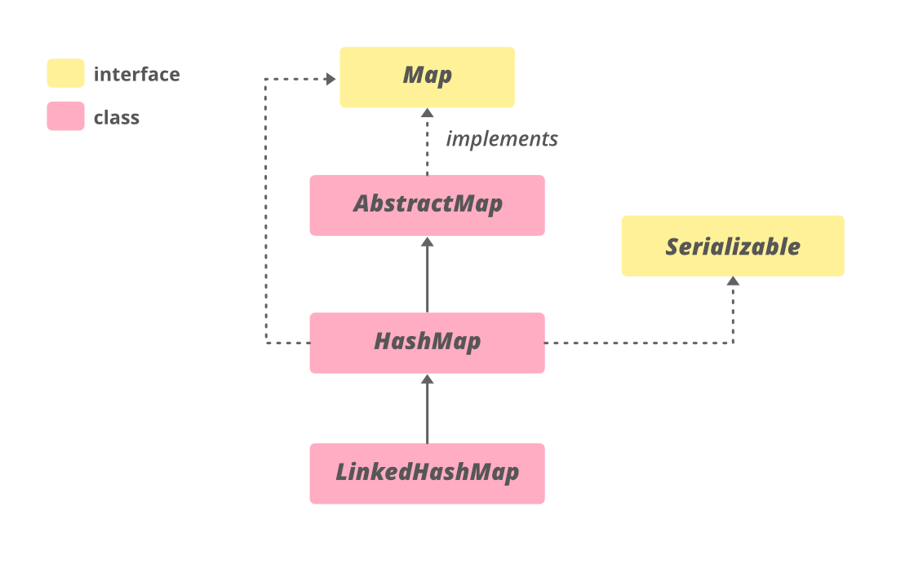
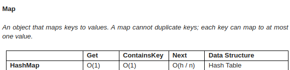
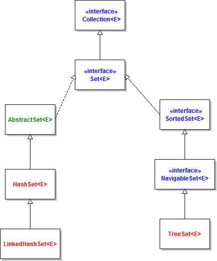
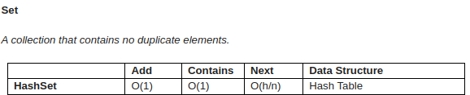
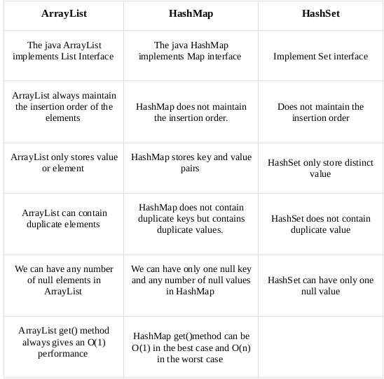

**0. Description**
- Collection is an object that holds a group of objects.In java , a framework named 
the 'Collection Framework' has been defined in JDK 1.2 which holds all the collection classes and interfaces.

 **1. ArrayList**
   - Java ArrayList is a part of the Java collection framework, and it is a class of java.util package. It provides us with dynamic arrays in Java. ArrayList class implements the List interface and inherits AbstractList.
   - The List interface in Java provides a way to store the ordered collection.It is the child interface of Collection.
   Basically, a list collection stores elements by insertion order.A List allows adding, retrieving, modifying , removing elements by an integer index.
- Like the example below:
  

**1.1 Hierarchy of Java ArrayList**

Advantages of ArrayList :

  * Dynamic size: ArrayList can dynamically grow and shrink in size, making it easy to add or remove elements as needed.
  * Easy to use: ArrayList is simple to use, making it a popular choice for many Java developers.
  * Fast access: ArrayList provides fast access to elements, as it is implemented as an array under the hood.
  * Ordered collection: ArrayList preserves the order of elements, allowing you to access elements in the order they were added.
  * Supports null values: ArrayList can store null values, making it useful in cases where the absence of a value needs to be represented.

Disadvantages of ArrayList :
  
  * Slower than arrays: ArrayList is slower than arrays for certain operations, such as inserting elements in the middle of the list.
  * Increased memory usage: ArrayList requires more memory than arrays, as it needs to maintain its dynamic size and handle resizing.
  * Performance degradation: ArrayList’s performance may degrade as the number of elements in the list increases, especially for operations such as searching for elements or inserting elements in the middle of the list.
 
ArrayList provides the functionality of a dynamic array where the size is not fixed.The size of the array automatically increase when we dynamically add and remove elements.
- Important features of ArrayList 
  + The size is automatically grow or shrinks if the ArrayList increases or decreases.
  + ArrayList can not return the primitive type like: int, char, bool ,... . It needs wrapper class .

- Performance of ArrayList: 
- 
- There are some popular methods in ArrayList:
    1. **add(int index, Object element)**: This method is used to insert a specific element at a specific position index in a list.
    2. **add(Object o)** :	This method is used to append a specific element to the end of a list.
    3. **addAll(Collection C)**: This method is used to append all the elements from a specific collection to the end of the mentioned list, in such an order that the values are returned by the specified collection’s iterator.
    4. **clear()**:	This method is used to remove all the elements from any list.
    5.  **get?(int index):**	Returns the element at the specified position in this list.
    6. **contains? (Object o):** Returns true if this list contains the specified element.
    7. **forEach?(Consumer<? super E> action)**:	Performs the given action for each element of the Iterable until all elements have been processed or the action throws an exception.
    8. **isEmpty?()**: Returns true if this list contains no element
    9. **remove?(int index)**	: Removes the element at the specified position in this list.
    10. **subList?(int fromIndex, int toIndex)** : Returns a view of the portion of this list between the specified fromIndex, inclusive, and toIndex, exclusive.

**2.HashMap**

- HashMap is a part of Java's collection.HashMao stores data in (Key,value) format.You can access the value through the key.If you try to insert the duplicate key in HashMap, it will replace the old element.

**2.1. Why and when use maps:**
- Maps are perfectly for key-value association mapping such as dictionaries. Use Maps when you want to retrieve and update elements by keys, or perform lookups by keys. Some examples:
  * A map of error codes and their descriptions.
  * A map of zip codes and cities.
  * A map of managers and employees. Each manager (key) is associated with a list of employees (value) he manages.
  * A map of classes and students. Each class (key) is associated with a list of students (value). 

**2.2. Hierarchy of Java HashMap in Java**
Characteristics of HashMap:
A HashMap is a data structure that is used to store and retrieve values based on keys. Some of the key characteristics of a hashmap include:

* Fast access time: HashMaps provide constant time access to elements, which means that retrieval and insertion of elements are very fast, usually O(1) time complexity.
* Uses hashing function: HashMaps uses a hash function to map keys to indices in an array. This allows for a quick lookup of values based on keys.
* Stores key-value pairs: Each element in a HashMap consists of a key-value pair. The key is used to look up the associated value.
* Supports null keys and values: HashMaps allow for null values and keys. This means that a null key can be used to store a value, and a null value can be associated with a key.
* Not ordered: HashMaps are not ordered, which means that the order in which elements are added to the map is not preserved. However, LinkedHashMap is a variation of HashMap that preserves the insertion order.
* Allows duplicates: HashMaps allow for duplicate values, but not duplicate keys. If a duplicate key is added, the previous value associated with the key is overwritten.

**2.3. Performance** 

- HashMaps provide constant time access to elements, which means that retrieval and insertion of elements are very fast, usually O(1) time complexity.

**2.4.Basic operations on a Map**
- The basic operations of a Map are association (put), lookup (get), checking (containsKeyand containsValue), modification (removeand replace) and cardinality (size and isEmpty).

1. put(K, V) :Associating a value with key  
   The put(K, V) method associates the specified value V with the specified key K. If the map already contains a mapping for the key, the old value is replaced by the specified value:
2. get(Object key): Getting a value associated with a specified key.
   The get(Object key) method returns the value associated with the specified key, or returns null if the map contains no mapping for the key.

3. containsKey(Object key): Checking if the map contains a specified key
   The method containsKey(Object key) returns true if the map contains a mapping for the specified key.

4. containsValue(Object value): returns true if the map contains one or more keys associated with the specified value.
5. remove(Object key)  : removes the mapping for a key from the map if it is present (we care about only the key, and the value does not matter). This method returns the value to which the map previously associated the key, or null if the map doesn’t contain mapping for the key.

6. replace(K key, V value): replaces the entry for the specified key only if it is currently mapping to some value. This method returns the previous value associated with the specified key.
7. The size() : returns the number of key-value mappings in this map
8. The isEmpty() : returns true if the map contains no key-value mappings
9. map.forEach((a,b) -> System.out.println("key" + a + " " + "value " + b)) : Iterating Over a Map using forEach()

3. HashSet
- Set is a type of collection that does not allow duplicate elements.An element can only exist once in a Set.

**3.1. Why and when use HashSet**
- Using Set collection when:
  *  You want to store elements distinctly without duplication, or unique elements.
  *  You don’t care about the order of elements.

Ex: You can use set to save the primary key of a table, store the numbers you do not want to duplicate

**3.2.Hierarchy of Java HashSet**

**3.3.Performance of HashSet**

3.4. Basic operations in HashSet
1. Adding elements to a Set:
  The add()method returns true if the set does not contain the specified element, and returns false if the set already contains the specified element:
2. Removing an element from a Set:
  The remove() method removes the specified element from the set if it is present (the method returns true, or false otherwise):
3. Check if a Set is empty:
  The isEmpty() method returns true if the set contains no elements, otherwise returns false:
4. Remove all elements from a Set:
  The clear() method removes all elements from the set. The set will be empty afterward:
5. Get total number of elements in a Set:
  The size() method returns the number of elements contained in the set:
6. Iterating over elements in a Set
7. Iterating over elements in a set

**4. Compare three collections** 

      

* REFERENCES: 
- https://www.geeksforgeeks.org/java-util-hashmap-in-java-with-examples/
- http://infotechgems.blogspot.com/2011/11/java-collections-performance-time.html
- https://www.codejava.net/java-core/collections/java-set-collection-tutorial-and-examples
- https://www.geeksforgeeks.org/hashset-in-java/