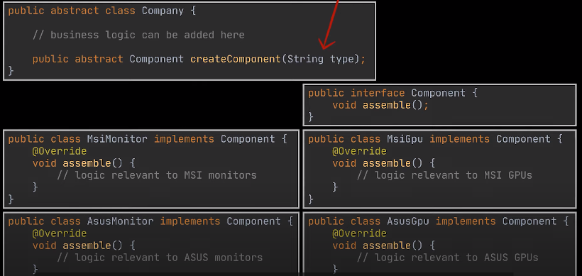
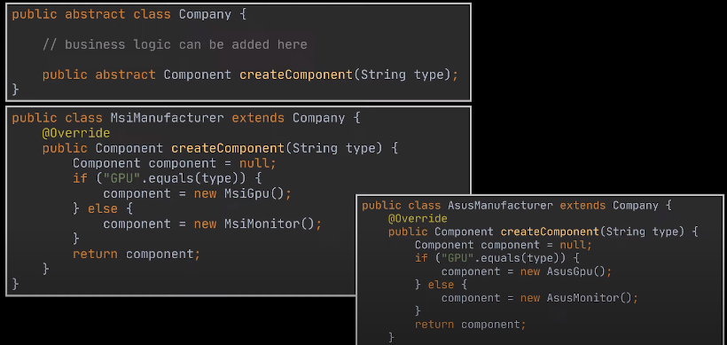

**1. Description**
- Abstract Factory is a creational design pattern that lets you produce families of related objects without specifying their concrete classes.

**2.Problem** 

- Imagine that you have a company which produces Monitor and Gpu. And you have a two type of product Msi and Asus.All class implements the Component interface.

------

- when a ManuFacturer wants to create a new component, they will create the new monitor or gpu based on the requests of the user.
- However, the code will see changes when we add a new component computer into the class, we must go to open the createComponent and change the code.
It will violate the open-closed principle, and when we scale the app will become more complex

=> The abstract factory method come out

**3. Solution**
- First, in my project , i declare interfaces for each distinct product : desk and chair. Then you can make all variants of products follow those interfaces such as: Modern and Old.
For example, oldChair and modern implement Chair
- Next i declare the company factory interface with a list of creation method.
There method should return concrete type of chair and desk.
- So, when we add new product , we only add new method to create new product.

**4. Applicability**
- Use the abstract Factory when your code needs to work with carious families of related products, but you don't want it to depend on the concrete classes of those products

**5. Pros and Cons**
-  You can be sure that the products you’re getting from a factory are compatible with each other.
- Open/Closed Principle.