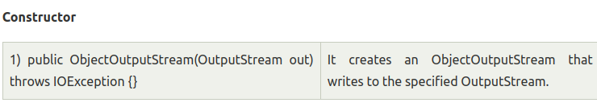
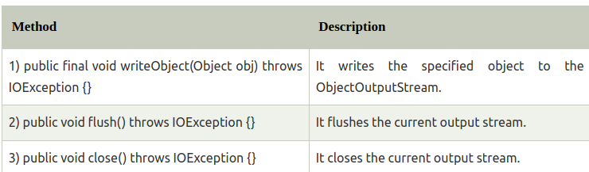
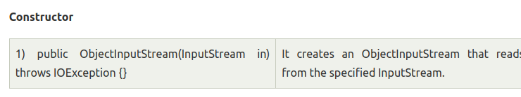
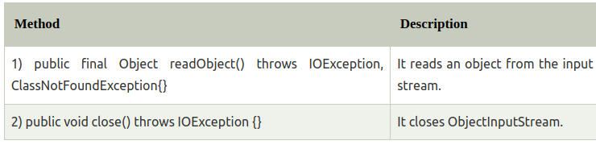

**1. Definition** 
- Serialization in Java is a mechanism of writing the state of an object into a byte-stream
- For serializing the object, we call the writeObject() method of ObjectOutputStream class
- we must implement the Serializable interface to excute serialization

**2. Advantages**
- It is mainly used to travel object's state on the network

**3. Implementations**

- The ObjectOutputStream is used to write primitive data and java objects  

- writeObject(Object x): write object to the ObjectOutputStream
- writeInt(Int i): write int value to the ObjectOutputStream
- writeChars(String s): write the String value to the ObjectOutputStream

- The ObjectInputStream is used to read from the inputStream

- The readObject() is used to read object from the input stream
- close() is used to close ObjectInputStream