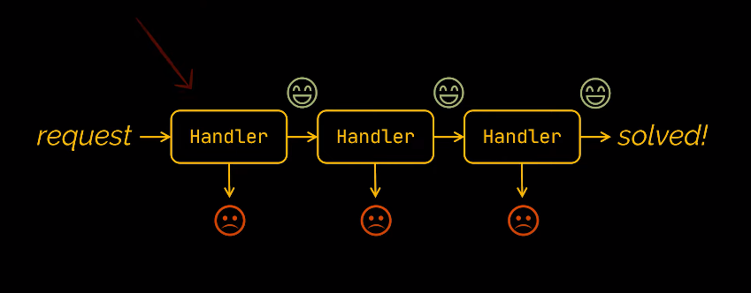
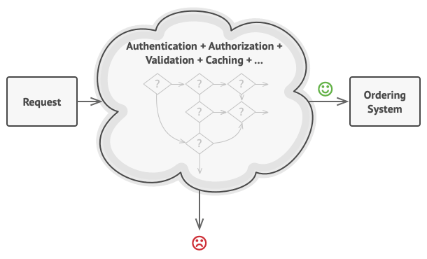

**1. Description**
- It is a behavioral design pattern that lets you pass requests along a chain of handlers.Upon receiving a request, each handler decides which request to process or to pass it to the next handler in the chain.
  
(Behavioral design patterns :  are concerned with algorithms and the assignment of responsibilities between objects.)

- The chain of responsibility pattern is used to pass the request to the next if the current object cannot handle it.Also, each handler can decide not to pass the request and stop any further processing

**2. Problem** 

Suppose you have a system, online ordering system.Only authenticated users can create orders, and the system will block authenticated users.In the future, you implemented more of the check, so the system will become more complex.

-> The code will become a mess, more complex and difficult to maintain.

**3.Solution**
- The Chain of Responsibility transforms behaviors into stand-alone objects called handlers.In my project, each checks seperate to each class with single method "handle".The request, along with it's data, is passed to this method as argument

- An example about real-world: When we call to the support in bank, first we will listen to the voice of the computer which suggests we choose an option. Then, depending on the request, the computer will choose the suitable services for me.It can run through many services, but only one object execute that

**4.When to use a chain of responsibility design pattern**

- Use the Chain of Responsibility pattern when your program is expected to process different kinds of requests in various ways, but the exact types of requests and their sequences are unknown beforehand.

-> The pattern lets you link several handlers into one chain and, upon receiving a request, “ask” each handler whether it can process it. This way all handlers get a chance to process the request.

- Use the pattern when we need to execute in an exact order.

