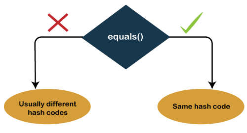

1. Overview
- equals() and hashCode() methods are present in Object class.
- Every java class gets the default implementation of equals() and hashCode().

2. equals() method
   - The java equals() is a method of lang.Object class, and it is used to compare two objects.
   - To compare two objects that whether they are the same, it compares the values of both the object's attributes.
   - By default, two objects will be the same only if stored in the same memory location.

3. hashCode()
- Java hashcode()
  - A hashcode is an integer value associated with every object in Java, facilitating the hashing in hash tables.
  - To get this hashcode value for an object, we can use the hashcode() method in Java. It is the means hashcode() method that returns the integer hashcode value of the given object.
  - The hashcode() method returns the same hash value when called on two objects, which are equal according to the equals() method. And if the objects are unequal, it usually returns different hash values.

4. HashMap and HashSet using equals() and hashCode()

Note: Collections such as HashMap and HashSet use a hashcode value of an object to determine how it should be stored inside a collection, and the hashcode is used again in order to locate the object in its collection.
- Hashing retrieval is a two-step process:

  - Find the right bucket (using hashCode())
  - Search the bucket for the right element (using equals() )
5. Usecase in my project
- I have a project about Student class; each Student has name, age, type attributes.
- I have created three instances with the same name, age but different types. I want when two students have the same types, so they are equal to each other.
But if I use compare two instances with the same type attribute, the same equal() method, they still return false.
- -> So we inherit the equals() and hashCode() to Overriding and return true if they have the same type attribute 
ademit

------
- Cấp phát bộ nhó arraylist
- Key null trong map ,tree map 