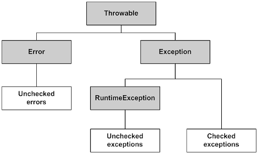
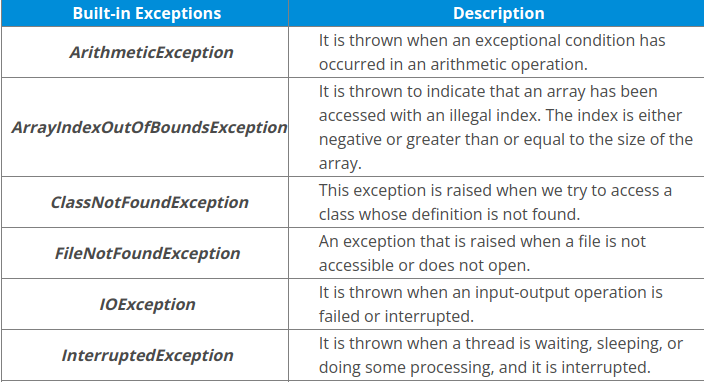

**1. Introduction**
- An exception is an error event that can happen during the execution of a program and disrupts its normal flow. Java provides a robust and object-oriented way to handle exception scenarios known as Java Exception Handling. 
- Exceptions in java can arise from different kinds of situations such as wrong data entered by the user,hardware failure, network connection failure, or a database server that is down. The code that specifies what to do in specific exception scenarios is called exception handling. 

- Java exception has been deployed by using class such as: Throwable, Exception, RuntimeException , and keywords like : throw, throws, try, catch and finally.
- Base on the problem, we can divide the exceptions into three types.

**2. The differences between "Checked Exceptions" and "Unchecked Exceptions" in Java**
   - Checked Exceptions: It is an exception is checked and notify by the compile-time in the compile time.
   
   Ex: When you open a file which does not exists.

   -  Unchecked Exceptions: is an exception which is not checked in the compile time. It is called Runtime Exceptions. Unchecked Exceptions inherit from Runtime Exception.
   
   Ex: NullPointerException

- TO summarize, the difference between a checked and unchecked exception is that a checked exception is caught at compile time whereas unchecked exception is caught at runtime.
A checked exception must be handled either by re-throwing or with a try-catch block, a runtime is not required to be handled.

**3. Throwing and Catching Exceptions**
- Java creates an exception object when an error occurs while executing a statement.The exception object contains a lot of debugging information such as method hierarchy, line number where the exception occurred, and type of exception.

- If an exception occurs in a method,the process of creating the exception object hading it over to the runtime environment is called "throwing the exception".Exception Handler ís the block handnler the block ò code that can process the exception object.

  1. First, the exception handler begins with searching in the method where the error occurred.
  2. If no appropirate handler is found, then it will move to the caller method.

- If an appropriate exception handler is found, the exception is passed to the handler to process it.The handler is said to be "catching the exception".If there is no appropriate exception exception handler, found then the program terminates and prints information about the exceptions.

**4. Keywords**

   - **_throw :_** we know that if an error occurs ,an exception object is getting created then Java runtime starts processing to handle them.Sometimes, we might want to generate exceptions explicitly in our code.Ex, in a user authentication program, we should throw exceptions to clients if the password is null. The throw keyword is used to throw exceptions to the runtime to handle it.
   - **_throws:_** When we are throwing an exception in a method and hot handling it, then we have to use the "throws" keywords in the method to let the caller program know the exceptions that might be thrown by the method.The caller method might hande these exceptions or notify them to its caller method using the throws keyword.
    we can provide multiple exceptions in the throws clause, and it can be used with main() function.
   - try-catch: We use the try-catch block for exception handling in our code. We can have multiple catch blocks with a try block.
   - **_finally_**: can be used only with a try-catch block.Because exception stop the process of execution, we might have some resources open that will not get closed => we can use the finally block.

**5.Types of Exceptions**
1) Some types of built-in exception:
 
2) User-Defined Exceptions: 
   Sometimes, the built-in exceptions in Java are not able to describe a certain situation. In such cases, a user can also create exceptions which are called ‘User-Defined Exceptions’.
   
Key points to note: 
+ user-defined exception must extend Exception class.
+ The exception is thrown using throw keyword.

**6. Some useful methods of Exception Classes**

- public String getMessage() – This method returns the message String of Throwable and the message can be provided while creating the exception through its constructor.

- public String getLocalizedMessage() – This method is provided so that subclasses can override it to provide a locale-specific message to the calling program. The Throwable class implementation of this method uses the getMessage() method to return the exception message.
- public synchronized Throwable getCause() – This method returns the cause of the exception or null if the cause is unknown.
- public String toString() – This method returns the information about Throwable in String format, the returned String contains the name of the Throwable class and localized message.
- public void printStackTrace() – This method prints the stack trace information to the standard error stream, this method is overloaded, and we can pass PrintStream or PrintWriter as an argument to write the stack trace information to the file or stream.