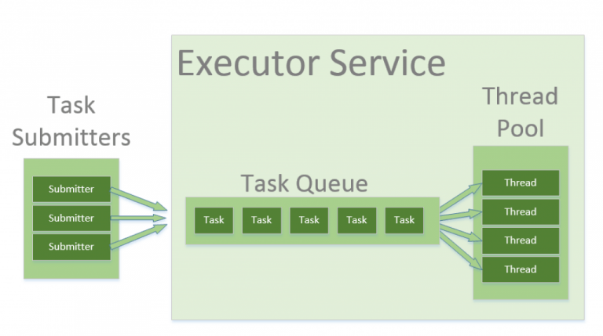
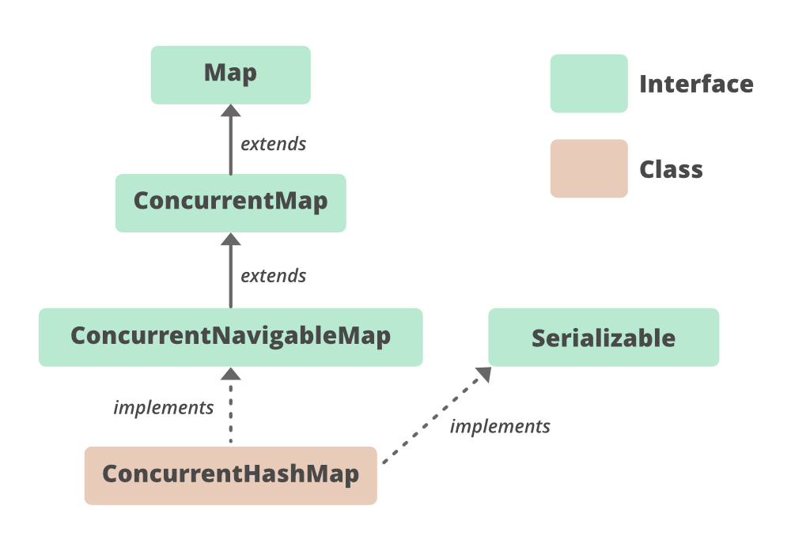

**1. Concurrency**
- Concurrency is the ability to run several programs or several parts of a program in parallel.If a time consuming task can be performed asynchronously or in parallel , it improves the abilities of the program.
- Process: run independently and isolated of other processes. It cannot directly access shared data in other processes.The process like memory, cpu time,... are allocated to it via the operating system.
- Thread: is a lightweight process.It can access shared data of other threads in the same process.Every thread has its own memory cache.If a thread reads shared data, it stores this data in its own memory cache.

**2. Runnable interface**
- Java runnable is an interface used to execute code on a concurrent thread.It is an interface thich is implemented by any class if we want the instances of that classes should be executed by a thread.
- public void run():This method takes in no arguments. When the object of a class implementing Runnable class is used to create a thread, then the run method is invoked in the thread which executes separately.
- The most common use case of the Runnable interface is when we want only to override the run method. When a thread is started by the object of any class which is implementing Runnable, then it invokes the run method in the separately executing thread.

**3. Thread Pool**

##### 3.1 Problem

- If we have more thread , so the task will performed faster ? It is not true.When a new Thread has been created , it will be allocated memory -> can lead to the crash application.
Ex: We write a app to upload 10000 file to Internet, suppose 1 file need 1 Thread => 10000 file need 10000 Threads execute in the same time.So it can lead to the overload and the crash of the app.

##### 3.2 Solution
- Thread pool manages the pool worker threads. It contains a queue that keeps tasks waiting to get executed.Java thread pool manages the collection of Runnable threads. The worker threads execute Runnable threads from the queue.

- java.util.concurrent.Executors provide factory and support methods for java.util.concurrent.
Executor interface to create the thread pool in java. Executors is a utility class that also provides useful methods to work with ExecutorService, ScheduledExecutorService, ThreadFactory, and Callable classes through various factory methods.
- Interface of the Executors class is ExecutorService , it resonponable for managing Threads and execute Runnable tasks.

**4. Lock**

##### 4.1 Synchronization

  
-  Synchronization in java is the capability to control the access of multiple threads to any shared resource. In the Multithreading concept, multiple threads try to access the shared resources at a time to produce inconsistent results. The synchronization is necessary for reliable communication between threads.

##### 4.2 Lock

- Lock is a tool for controlling access to a shared resource by multiple threads.Commonly a lock provide exclusive access to a shared resource:only one thread at a time can acquire the lock and all access to the shared resource requires that the lock be acquired first.
- Lock is a thread synchronization mechanism just like synchronized blocks.But Lock is more flexible and more sophisticated than a synchronized block.
- As the name suggest, it allows threads to re-enter into lock on a resource more than once. When the thread first enters into lock, a hold count is set to one. Before unlocking the thread can re-enter into lock again and every time hold count is incremented by one. For every unlock request, hold count is decremented by one and when hold count is 0, the resource is unlocked.
- ReentrantLock : It is a class implement interface Lock.ReentrantLock don't limit the number of access resources of a thread.When a thread accesses firstly resources, it is assigned a counter =1. Before it releases the resources , i can re-access the resources, and each time the counter+1. With each require unlock, the counter -1 , when the counter = 0 => the resources will release. 

**5. Atomic integer**

- An operation is atomic when you can safely perform the operation in parallel on multiple threads without using the synchronized keywords or lock.
- When a value is not an atomic operation, so by the time one threads read it.s value increment it by one, other thread has read the older value leading to wrong result.
=> TO resolve this issue, we will have to make sure that increment operation on count is atomic (similar to Synchronization).

**6. Concurrent hashmap**

- ConcurrentHashMap is a thread-safe implementation of the Map interface in Java, Which means multiple threads can access it simultaneously with any synchronizaton issues.
- One of the key features of the ConcurrentHashMap is that is provides find-grained locking, meaning that it locks only the portion of the map being modified, rather than the entire map.This make it highly scalable and efficient for concurrent.Additionally, the ConcurrentHashmap provides various methods for atomic operations.
- Key points of ConcurrentHashMap:  
    + The underlined data structure for ConcurrentHashMap is Hashtable.
    +  ConcurrentHashMap class is thread-safe i.e. multiple threads can operate on a single object without any complications.
    + At a time any number of threads are applicable for a read operation without locking the ConcurrentHashMap object which is not there in HashMap.
    + In ConcurrentHashMap, at a time any number of threads can perform retrieval operation but for updated in the object, the thread must lock the particular segment in which the thread wants to operate. This type of locking mechanism is known as Segment locking or bucket locking. Hence at a time, 16 update operations can be performed by threads.
  
    +  Inserting null objects is not possible in ConcurrentHashMap as a key or value.
