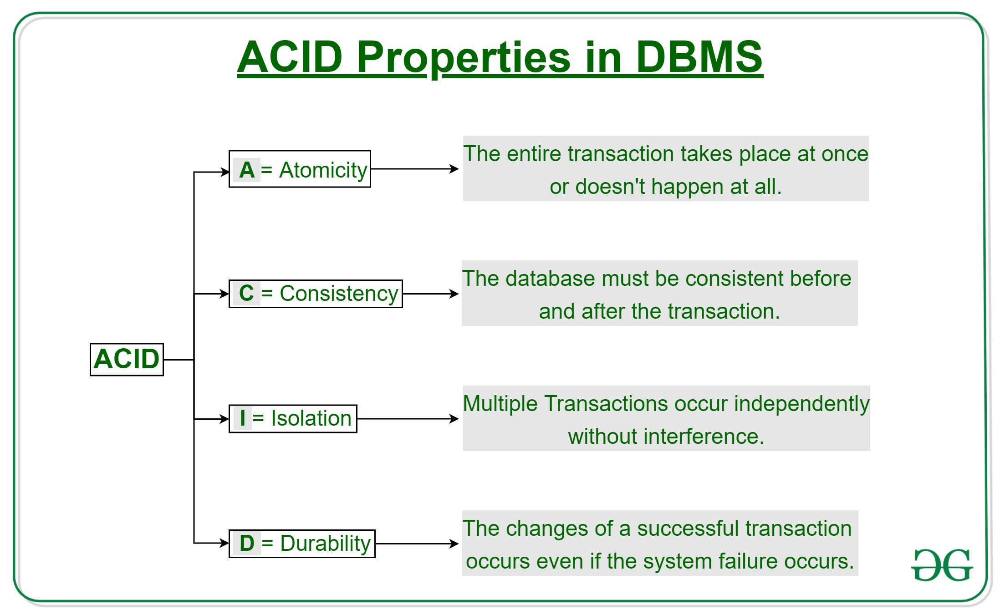
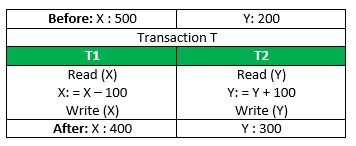
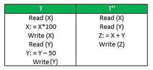

**1.Definition**

- A transaction is a single logical unit of work that accessed and possibly modifies the contents of a database. Transactions access data using read and write operation
- In order to maintain consistency in a database , before and after the transaction, certain properties are followed, These are called ACID properties.

 

- **Atomicity:** IT means that either the entire transaction takes place at once or doesn't happen at all.There is no midway transactions do not occur partially. Each transaction is considered as one unit and either runs to completion or is not executed at all.It involves the following two operations.
    Abort: If a transaction aborts, changes made to the database are not visible 
- Commit : If a transaction commits, changes made are visible 
- It also known as the "all or nothing "
  Consider the following transaction T consisting of T1 and T2: Transfer of 100 from account X to account Y. 

- If the transaction fails after completion of T1 but before completion of T2.( say, after write(X) but before write(Y)), then the amount has been deducted from X but not added to Y. This results in an inconsistent database state. 

- **Consistency** : Data is in a consistent state when a transaction starts and when it ends.
    Example: in an application that transfers funds from one account to another, the consistency property ensures that the total value of funds in both the accounts is the same at the start and end of each transaction.

- Isolation : 
    The intermediate state of a transaction is invisible to other transactions.As a result, transactions that run concurrently appear to be serialized.

Suppose T has been executed till Read (Y) and then T’’ starts. As a result, interleaving of operations takes place due to which T’’ reads the correct value of X but the incorrect value of Y and sum computed by
T’’: (X+Y = 50, 000+500=50, 500)
is thus not consistent with the sum at end of the transaction:

T: (X+Y = 50, 000 + 450 = 50, 450).
This results in database inconsistency, due to a loss of 50 units. Hence, transactions must take place in isolation and changes should be visible only after they have been made to the main memory. 

**Durability**

After a transaction successfully completes, changes to data persist and are not undone, even in the event of a system failure.

. These updates now become permanent and are stored in non-volatile memory. The effects of the transaction, thus, are never lost.

For example, in an application that transfers funds from one account to another, the durability property ensures that the changes made to each account will not be reversed.