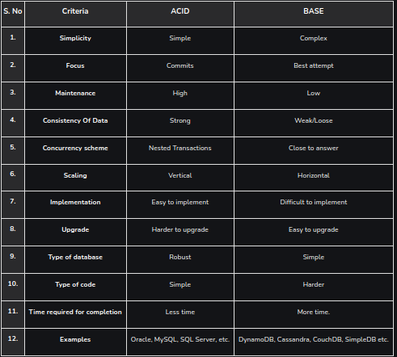

**Base Model:**

The rise in popularity of NoSQL databases provided a flexible and fluidity with ease to manipulate data and as a result, a new database model was designed, reflecting these properties. The acronym BASE is slightly more confusing than ACID but however, the words behind it suggest ways in which the BASE model is different and acronym BASE stands for:-

**Basically Available:** Instead of making it compulsory for immediate consistency, BASE-modelled NoSQL databases will ensure the availability of data by spreading and replicating it across the nodes of the database cluster.

**Soft State:** Due to the lack of immediate consistency, the data values may change over time. The BASE model breaks off with the concept of a database that obligates its own consistency, delegating that responsibility to developers.

**Eventually Consistent:** The fact that BASE does not obligates immediate consistency but it does not mean that it never achieves it. However, until it does, the data reads are still possible (even though they might not reflect reality).

**2. Compare BASE abd ACID**

