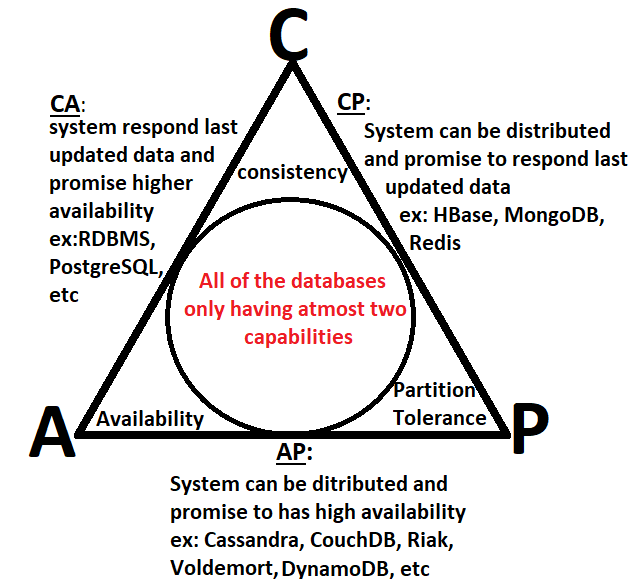

**1.Definition**
- The Cap theorem , introduced as CAP principle, can be used to explain some of the competing requirements in a distributed system with replication.The Cap theorem applies a logic to distributed systems that a distributed system can deliver only two of three desired characteristics: _consistency_, _availability_ and _partition tolerance_
- A distributed system is a network that stores data on more than oen node(physical or virtual machines) at the same time.
- The CAP theorem states that it is not possible to guarantee all three of the desirable properties - consistency, availability at the same time in a distributed system with data replication

**2. 'CAP' in the CAP theorem**
- Consistency : all clients see the same data at the same time,no matter which node that connect to.For this to happen whenever data is written to one node, it must be instantly forwarded or replicated to all the other nodes in the system before the write is deemed 'successful'
- Availability: means that any client making a request for data gets a response, even if one or more nodes are down.It means , all working nodes in the distributed system return a valid response for any request, without exception.Every node must be able to respond in a reasonable amount of time.
- Partition tolerance : a partition is a communication break within a distributed system - a lost or temporarily delay connection between two nodes.Partition tolerance means that the cluster must continue to work despite any amount of communication breakdowns between nodes in the system

**3. CAP theorem NoSQL database types**

-  NoSQL databases are ideal for distributed network application.They are horizontally scalable and distributed by design.The can rapidly scale across a growing network consisting of multiple interconnected nodes.

- CP database: delivers consistency and partition tolerance at the expense of availability.When a partition occurs between any two nodes, the system has to shut down the non-consistent node
  
    Example databases: Apache HBase, MongoDB, Redis.
- AP databse: An Ap database delivers availability and partition tolerance at the expense of consistency.When a partition occurs, all nodes remain available but those at the wrong end of a partition might return an older version of data
  
    Example databases: Amazon DynamoDB, Google Cloud Spanner.

- CA database: A CA database delivers consistency and availability across all nodes. It can’t do this if there is a partition between any two nodes in the system, however, and therefore can’t deliver fault tolerance.
  Example databases: Cassandra, ...
