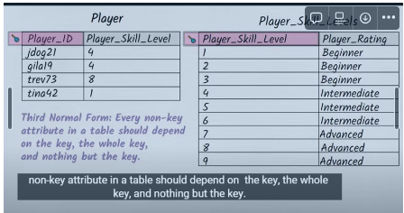

**1.Description of normalization**

Normalization is the process of organizing data in a database. It includes creating tables and establishing relationships between those tables according to rules designed both to protect the data and to make the database more flexible by eliminating redundancy and inconsistent dependency.

**2. 1NF (First normal form )** 

- Eliminate the repeating groups in individual tables

- Having a table without a primary key is not permitted : Because without the primary we can have the duplicate values
- Repeating groups are not permitted:

when we want to get an only item like coins we must get all the inventory

If we create each type of inventory for one column like this, If we scale for hundread of inventory it will lead complex  

=> The answer is created a column for each type ,each row tells us the unique item

**2. 2NF**

- Each attribute depend on the whole primary key, not just part of it

Like example above: the player_rating only depended on ghe player_id ,but the whole primary key are: player_id and item_type

So the Player should have own table

**3. NF**

- Every non-key attribute in a table should depend on the key,the whole key, nothing only the key

- In the below example,the player_rating depend on player_skill_level , the player_skill_level depend the player_id , it lead to the redundant inefficient    

- We need to seperate the table like this, depend on bridging properties

 