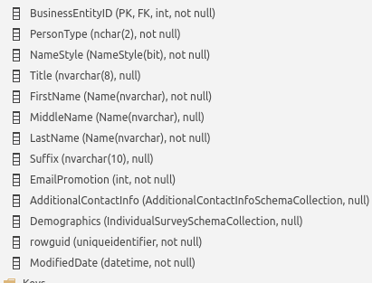
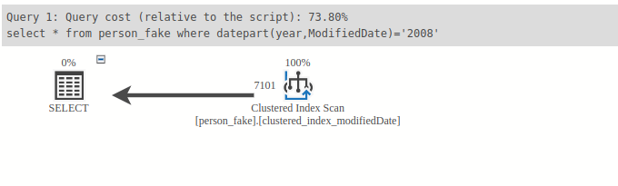
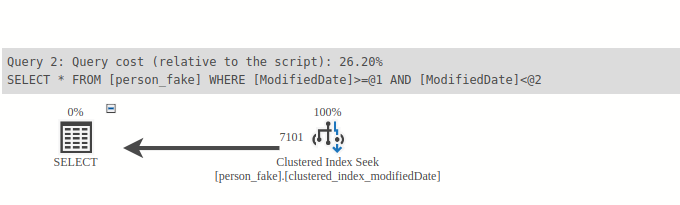

**Ex1: Check for the unused index because of the implicit data type** 

- Here is my example table


- First, I create a clustered index on the ModifiedDate key  

    ```
    create clustered index clustered_index_modifiedDate on person_fake(ModifiedDate);`
  ```
 
- Here is the query with the implicit date type ,convert the Datetime to the varchar to compare so the index can't be used in here
  
```agsl

select * from person_fake 
where datepart(year,ModifiedDate)= '2008';
```

- In here there is no data type convert, so the data will use clustered index seek.

```
select * from person_fake 
where ModifiedDate >= '2008/01/01' and ModifiedDate < '2009/01/01';

```  



