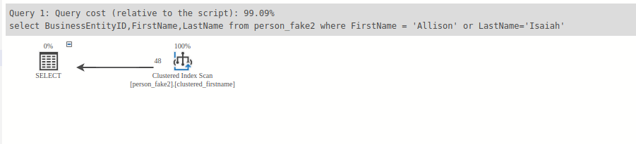
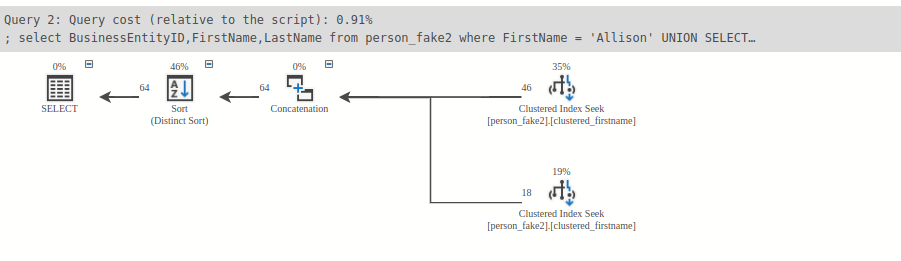

Ex2 : Avoid using OR in the filter condition

- When we use or operator we can not use the clustered index on the FirstName column, so the query run very slowly
```agsl

select BusinessEntityID,FirstName,LastName from person_fake2
where FirstName = 'Allison' or LastName='Isaiah';


```
- Insteads, we use the union operator, so when we split the query, SQL server will can use the index to seek.

```agsl
select  BusinessEntityID,FirstName,LastName from person_fake2
where FirstName = 'Allison'
UNION
SELECT BusinessEntityID,FirstName,LastName FROM person_fake2
WHERE FirstName = 'Isaiah';

```


