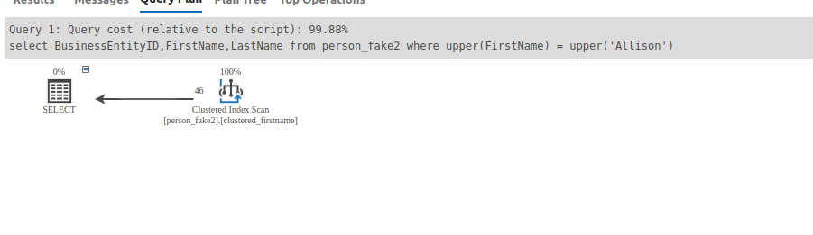

**Ex3: Using the upper,lower function**

- When we use the upper function to filter, we can not use the index to seek 
```
select BusinessEntityID,FirstName,LastName from person_fake2
where upper(FirstName) = upper('Allison');
```
- In the execution plan , we can see it cost over 99% with much more than the query below


- We need to avoid using the upper,lower function when we need the use of the index
```
select BusinessEntityID,FirstName,LastName from person_fake2
where  FirstName = 'Allison';
```

Ex4: Use operator EXISTS, IN 

*   EXISTS is much faster than IN, when the sub-query results is very large.
*   IN is faster than EXISTS, when the sub-query results is very small.

Ex: Like example , instead of using in statement, we should use the exists because the subquery is very large
```

select count(*) as a from person_fake2
where exists(select * from person_fake where person_fake2.FirstName= person_fake.FirstName)
```

```agsl
select count(*) as b from person_fake2
where FirstName in(select FirstName from person_fake)
```
