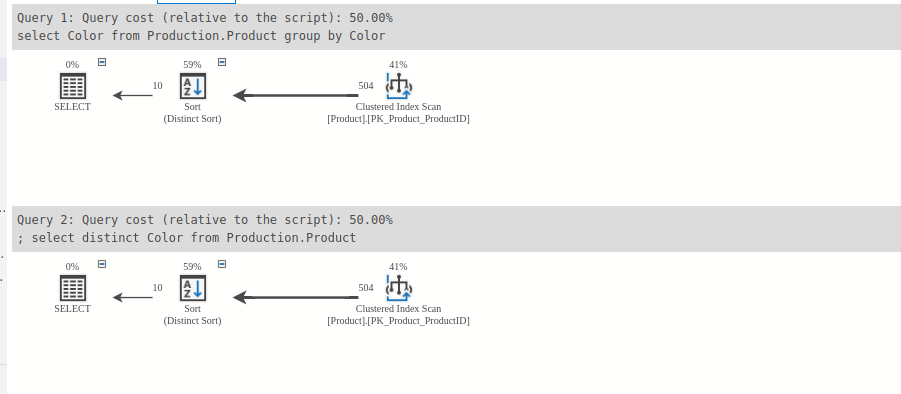

Ex 5: Avoid using SELECT DISTINCT

The SQL DISTINCT operator is used to select only unique values of the column and thus eliminate duplicated values. 

```
select distinct Color from Production.Product;


```
- In here , because the size of the Color columns are very small so we do not see many different

- Instead , we use the group by to select only value
```agsl

select Color from Production.Product
group by Color
;

```
