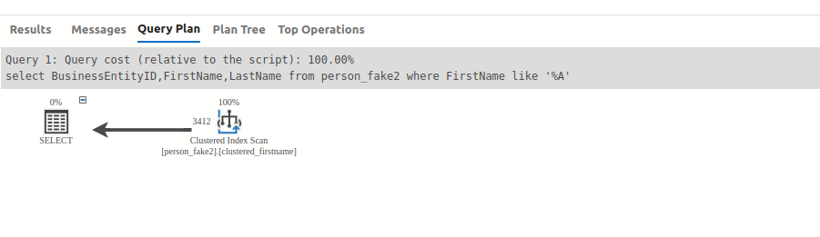

Ex6: Use wildcards at the end of the values

- In here, we have a clustered index on the FirstName, but when we filter for the FirstName with end with the A letter ,
we can not use the index to week
```agsl
select BusinessEntityID,FirstName,LastName from person_fake2
where FirstName like '%l';

```
- In here,The SQL server use the index scan to find the values ,lead to the bad performance


-> Solution: running the REVERSE() function on it for easier back-searching.
- We reverse the FirstName to the FirstNameReverse , than use the 
Reverse() function.
```agsl

select BusinessEntityID,FirstNameReverse,LastName from person_fake2
where FirstNameReverse like REVERSE('%l');
```

